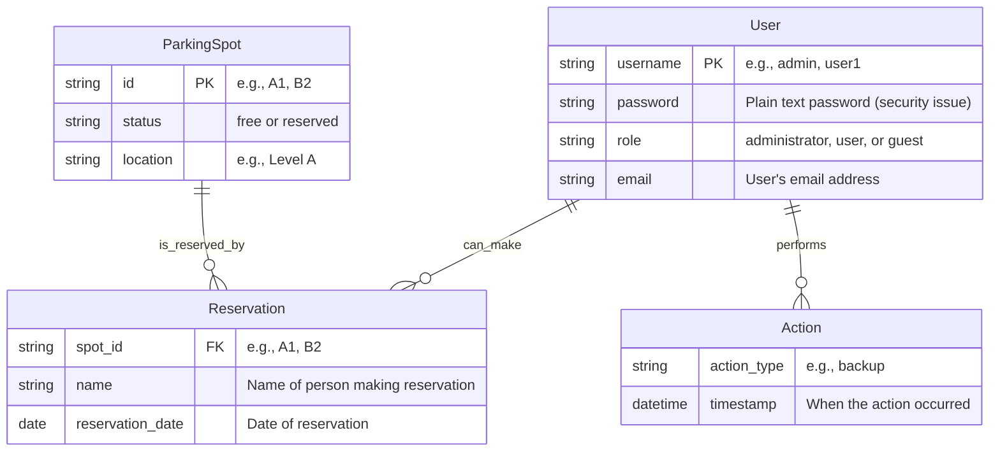

# rbcz_gh-copilot-basic_carpool
Flask GUI application for parking reservations

## Context:
Create ultra modern fancy gui
for parking reservations using Flask and SQLite. The application allows users to manage parking spots, make reservations, and view available parking places.

## Key Features:

Database reservation and parking places store to SQLite

Simple GUI for managing parking reservations

List available parking places

Create, update, and delete reservations

Avoid double-booking

Simple authentication

# Datový model

Diagram níže znázorňuje strukturu databáze

Hlavní entity v aplikaci:
- **ParkingSpot** - Parkovací místa definovaná v SQLite databázi
- **Reservation** - Rezervace uložené v SQLite databázi s parkovacím místem jako klíčem
- **User** - Uživatelské účty uložené v SQLite databázi
- **Action** - Systémové akce zaznamenané v SQLite databázi

