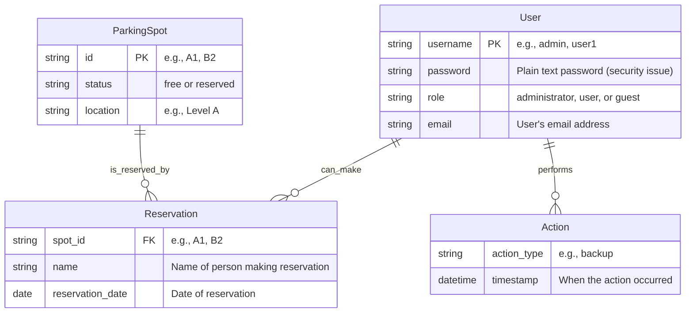

# rbcz_gh-copilot-basic_carpool
Flask GUI application for parking reservations

> Modern REST-driven parking reservation platform built with Flask + SQLite. All UI data is hydrated via JSON REST endpoints (see Data & Template Policy).

## Context:
Create ultra modern fancy gui
for parking reservations using Flask and SQLite. The application allows users to manage parking spots, make reservations, and view available parking places.


## Key Features (Business Requirements)

Database reservation and parking places store to SQLite

Simple GUI for managing parking reservations

List available parking places

Create, update, and delete reservations

Avoid double-booking

Simple authentication

Status Legend (planned vs implemented will be tracked later): ✅ Implemented | 🛠 Planned | 🔍 Under evaluation

| Feature | Status | Notes |
|---------|--------|-------|
| Create reservation | 🛠 | Prevent double-book via DB constraint |
| Update reservation | 🛠 | Partial update semantics TBD |
| Cancel reservation | 🛠 | Soft vs hard delete (hard planned) |
| List available spots | 🛠 | Filter by date, status |
| User authentication | 🛠 | Flask-Login session-based |
| Audit trail | 🛠 | Stored in `Action` table |
| Admin dashboard | 🔍 | After core API |
| Charts / Analytics | 🔍 | Via Chart.js consuming JSON |
| Rate limiting | 🔍 | Flask-Limiter integration |
| OpenAPI docs | 🔍 | auto-generated spec |

---

## Tech Stack

Backend:
- Python 3.11+ (target) / 3.9+ compatible
- Flask (core web framework)
- Flask-SQLAlchemy + SQLite (dev) / PostgreSQL (future prod)
- Flask-Migrate (Alembic migrations)
- Flask-Login (session auth)
- Flask-WTF (forms + CSRF for any server-rendered forms)
- (Planned) Marshmallow or Pydantic for API payload validation

Frontend:
- Jinja2 templates as shells only (no embedded domain data)
- Bootstrap 5 (layout + components)
- Vanilla ES6 modules / optional build step later
- Chart.js for visualizations
- Fetch API / optional Axios for REST calls

Tooling & Quality:
- pytest, pytest-flask, factory-boy, coverage
- black, isort, flake8 (planned pre-commit hook)
- mypy (strict incremental adoption)

---

## Architecture & Folder Structure (Planned)

```
app/
    __init__.py            # Application factory
    extensions.py          # db, migrate, login_manager, csrf, limiter
    models/                # SQLAlchemy models
        parking_spot.py
        reservation.py
        user.py
        action.py
        __init__.py
    services/              # Business logic (availability checks, auditing)
        reservation_service.py
        user_service.py
        spot_service.py
        audit_service.py
    api/                   # Blueprint: /api/v1
        __init__.py
        reservations.py
        spots.py
        auth.py
        users.py
        health.py
    web/                   # Blueprint: / (minimal templates)
        __init__.py
        views.py
    templates/             # Jinja2 (layouts + empty containers)
        base.html
        index.html
        login.html
    static/
        css/
        js/
            main.js            # fetch + DOM hydration
            reservations.js
            spots.js
    cli/                   # Custom Flask CLI commands
        seed.py
    config/                # Configuration objects
        settings.py
tests/
    unit/
    integration/
    factories/
    api/
migrations/              # Alembic
requirements.txt
.env.example
```

Key Rules:
- All domain reads/writes flow through services.
- API layer: thin orchestration + validation + error mapping.
- Templates never directly query database.
- One model per file; keep each under ~200 lines.

Cross-reference: see Data & Template Policy below for UI interaction requirements.

---

## Quick Start (Planned Scaffold)

```
git clone <repo_url>
cd rbcz_gh-copilot-basic_carpool
python3 -m venv .venv
source .venv/bin/activate
pip install -r requirements.txt
cp .env.example .env
flask db upgrade   # once migrations exist
flask run
```

Visit: http://127.0.0.1:5000/

---

## Configuration (.env)

| Variable | Required | Default | Description |
|----------|----------|---------|-------------|
| FLASK_ENV | No | development | Runtime environment |
| SECRET_KEY | Yes | (none) | Session & CSRF secret |
| DATABASE_URL | No | sqlite:///parking.db | SQLAlchemy database URL |
| LOG_LEVEL | No | INFO | Logging verbosity |
| ADMIN_DEFAULT_USERNAME | No | admin | Seed admin user |
| ADMIN_DEFAULT_EMAIL | No | admin@example.com | Seed admin email |
| RATE_LIMIT | No | 100/hour | Planned rate limit policy |

Secrets Policy:
- No secrets committed.
- Provide `.env.example` with placeholder values.

---

## Database & Migrations

Double-booking prevention: enforce UNIQUE constraint `(spot_id, reservation_date)` in `reservations` table.

Migration Workflow (future):
```
flask db migrate -m "Add reservation unique constraint"
flask db upgrade
```

Seeding (planned CLI):
```
flask seed admin
flask seed demo-data
```

---

## REST API Conventions (Draft)

Base Path: `/api/v1`

Response Shapes:
```
Success: { "data": <payload>, "meta": { ...optional... } }
Error:   { "error": { "code": "RESERVATION_CONFLICT", "message": "Spot already booked" } }
```

Pagination: `?page=1&page_size=20` (max 100)
Sorting: `?sort=reservation_date:asc` (multi-sort future: comma-separated)
Filtering examples: `/api/v1/spots?status=free&date=2025-09-05`

HTTP Method Semantics:
- POST /reservations : create (idempotency key future)
- PATCH /reservations/{id} : partial update
- DELETE /reservations/{id} : remove

Error Codes (initial set):
- VALIDATION_ERROR
- AUTH_REQUIRED
- AUTH_INVALID
- NOT_FOUND
- RESERVATION_CONFLICT
- INTERNAL_ERROR

Versioning: bump path when backward-incompatible changes accumulate.

---

## Planned API Endpoints (Initial)

| Method | Path | Purpose | Auth | Notes |
|--------|------|---------|------|-------|
| GET | /api/v1/health | Liveness/DB check | None | Returns status + timestamp |
| POST | /api/v1/auth/login | Login session | None | Rate limited |
| POST | /api/v1/auth/logout | End session | Session |  |
| GET | /api/v1/spots | List/filter spots | Session | Query params: status, date |
| GET | /api/v1/spots/{id} | Spot detail | Session | 404 if missing |
| GET | /api/v1/reservations | List reservations | Session | Filter by date, user |
| POST | /api/v1/reservations | Create reservation | Session | Enforce uniqueness |
| PATCH | /api/v1/reservations/{id} | Modify reservation | Session | Only owner or admin |
| DELETE | /api/v1/reservations/{id} | Cancel reservation | Session | Audit logged |
| GET | /api/v1/users/me | Current user profile | Session |  |
| GET | /api/v1/actions | Audit log | Admin | Pagination required |

---

## Security & Authentication (Planned)

- Passwords stored using PBKDF2 (Werkzeug `generate_password_hash`).
- Sessions: Flask-Login + secure cookies.
- CSRF: Flask-WTF for any form endpoints (web blueprint) and manual token (custom header `X-CSRF-Token`) for unsafe API verbs if required.
- Rate Limiting: applied to auth + reservation creation endpoints.
- Headers: Security middleware (Flask-Talisman planned) for CSP, HSTS (prod), Referrer-Policy, Permissions-Policy.
- Input Validation: central validator (Marshmallow / Pydantic) – reject extraneous fields.
- Unique constraints for data integrity instead of application-only checks.
- Future: optional 2FA for admin, JWT tokens for external API consumers.

---

## Testing Strategy

Test Layers:
- Unit: services, utilities (pure logic)
- Integration: API endpoints with test client + in-memory SQLite
- Contract (future): OpenAPI schema compliance tests

Conventions:
- All API endpoints MUST have at least: success test + 1 failure path.
- Factories for test data: `tests/factories/*.py` using factory-boy.
- Coverage Goal (initial): 80% lines, 70% branches (raise later).
- Do not mix unit and integration tests in same file.

Example Commands (future):
```
pytest -q
pytest --cov=app --cov-report=term-missing
```

---

## Logging & Audit

Structured Logging Fields (planned): timestamp, level, message, request_id, user_id, path, latency_ms.

Action Table Usage (enum-style types):
- RESERVATION_CREATE
- RESERVATION_UPDATE
- RESERVATION_DELETE
- LOGIN_SUCCESS
- LOGIN_FAILURE
- USER_CREATE
- BACKUP_START
- BACKUP_FINISH

Retention strategy (future): archive entries older than 180 days.

---

## Performance & Concurrency (Guidelines)

- Avoid N+1 queries: use eager loading for reservation + spot combos.
- Add DB indexes: `reservation (reservation_date)`, `reservation (spot_id, reservation_date)` UNIQUE.
- Handle double-book race: rely on UNIQUE constraint + catch IntegrityError -> map to RESERVATION_CONFLICT.
- Future caching layer: read-mostly endpoints (spots availability) with short TTL.

---

## Frontend Hydration Model

Templates deliver skeletal HTML. JavaScript fetches JSON and populates:
- Reservation table
- Spot status badges
- Availability counters
- Charts (occupancy over time)

No business JSON embedded inline; only minimal global config (e.g., `window.APP_CONFIG = { csrfToken: "..." }`).

---

## Roadmap (Initial)

Phase 1 (MVP): Models, migrations, auth (session), reservations CRUD, spot listing, audit logging.
Phase 2: Validation layer, rate limiting, OpenAPI spec generation, structured logging.
Phase 3: Charts dashboard, performance tuning, admin management UI, internationalization.
Phase 4: Deployment hardening (Docker, gunicorn), monitoring (Prometheus / Sentry), scalability review.

Stretch: Mobile-friendly PWA shell, WebSocket push for spot updates, Redis caching.

---

## Contribution Guidelines (Draft)

Branch Naming: `feature/<short-desc>`, `fix/<issue>`, `chore/<task>`
Commit Style (suggested): Conventional Commits (`feat:`, `fix:`, `chore:`, `docs:` ...)
Opening a PR: ensure tests pass, coverage not dropping, README updated if feature user-visible.
Prohibited: committing secrets, embedding domain data in templates, bypassing service layer.

---

## License

TBD (MIT recommended). Add `LICENSE` file before initial release.

---

## Notes

This README describes target architecture. Some elements are not yet implemented; treat sections marked Planned/Draft as a specification backlog.

---

## Data & Template Policy

All application data (parking spots, reservations, users, audit actions, statistics) MUST be accessed and modified exclusively through REST API endpoints that return JSON. Server-side templates (Jinja2) are used only for structural layout, component shells, and bootstrapping minimal values such as a CSRF token or feature flags—never for embedding full data sets. Dynamic page content (tables, charts, lists, counters) is populated via asynchronous JavaScript (AJAX / Fetch) calls to the REST API.

Design Principles:
- No hardcoded domain data in templates or JavaScript bundles.
- No direct SQL or ORM queries inside template rendering functions—use service + API layer.
- REST endpoints are the single source of truth; UI consumes only their JSON responses.
- Templates may include: static assets references, empty containers (div/table) for hydration, minimal meta/config.
- Caching (if added later) must occur at the API/service layer, never by dumping large blobs into HTML.

Benefits:
- Ensures clear separation of concerns (presentation vs. data access).
- Simplifies future front-end rewrites or adding SPA/mobile clients.
- Reduces risk of stale or inconsistent data states across pages.
- Eases automated testing of business logic via API tests.

Enforcement Suggestions (to be implemented as project grows):
- Lint/grep checks disallowing large JSON literals in templates.
- Code review checklist item: "No business data injected directly into template context." 
- Centralized service layer functions used by all API routes.


# Datový model

Diagram níže znázorňuje strukturu databáze



Hlavní entity v aplikaci:
- **ParkingSpot** - Parkovací místa definovaná v SQLite databázi
- **Reservation** - Rezervace uložené v SQLite databázi s parkovacím místem jako klíčem
- **User** - Uživatelské účty uložené v SQLite databázi
- **Action** - Systémové akce zaznamenané v SQLite databázi


