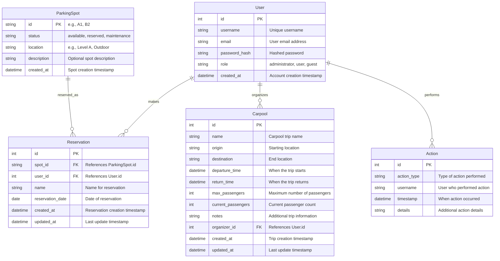

# rbcz_gh-copilot-basic_carpool
Flask GUI application for carpool parking reservations

## Context:
Modern web application for managing carpool parking reservations using Flask and SQLite. The application provides a comprehensive system for users to manage parking spots, make reservations, and administrators to oversee the entire system with detailed logging and analytics.

## Key Features:

### Core Functionality
- **Database Integration**: All data stored in SQLite with comprehensive models
- **User Authentication**: Secure login/logout with Flask-Login
- **Role-Based Access Control**: Administrator, user, and guest roles
- **Parking Spot Management**: Create, update, and delete parking spots
- **Reservation System**: Make, edit, and cancel reservations
- **Double-Booking Prevention**: Automatic validation to prevent conflicts
- **User Profile Management**: View and manage user account information

### Advanced Features
- **Admin Dashboard**: Comprehensive administrative interface with:
  - User management (create, edit, delete, role assignment)
  - System activity monitoring with Chart.js visualizations
  - Detailed logging system with filterable activity logs
  - Quick statistics overview
- **Carpool Management**: Full CRUD operations for carpool trips
- **Responsive Design**: Bootstrap 5 UI with modern styling
- **Real-time Data**: AJAX-powered dynamic content loading
- **Form Validation**: Flask-WTF forms with CSRF protection
- **Security Features**: Password hashing, session management, input validation

### User Interface
- **Dashboard**: Activity overview with statistics and charts
- **Profile Management**: User account details and reservation history
- **Admin Tools**: Complete administrative control panel
- **Logging System**: Comprehensive audit trail with filtering capabilities
- **Modern UI**: Clean, responsive design with FontAwesome icons

# Database Schema

The application uses SQLite with the following enhanced schema:



## Main Entities:

- **User**: User accounts with authentication and role-based permissions
- **ParkingSpot**: Physical parking locations with status tracking
- **Reservation**: Parking reservations linking users to spots
- **Carpool**: Carpool trip organization with passenger management
- **Action**: System audit log for tracking all user activities

## Technical Stack:

- **Backend**: Flask 2.3+ with Python 3.9+
- **Database**: SQLite with SQLAlchemy ORM
- **Frontend**: Bootstrap 5, Chart.js, jQuery 3.x
- **Authentication**: Flask-Login with password hashing
- **Forms**: Flask-WTF with CSRF protection
- **Testing**: pytest with factory-boy for test data
- **Security**: Flask-Talisman for security headers

## Project Structure:

```
carpool/
├── __init__.py           # Application factory
├── config.py            # Configuration settings
├── extensions.py        # Flask extensions
├── models/              # SQLAlchemy models
├── views/               # Route handlers (blueprints)
├── services/            # Business logic layer
├── forms/               # WTF forms
├── templates/           # Jinja2 templates
├── static/              # CSS, JS, images
tests/
├── unit/                # Unit tests with mocking
├── integration/         # Integration tests
├── conftest.py          # Test configuration
└── factories.py         # Test data factories
```

## Installation & Setup:

1. Install dependencies: `pip install -r requirements.txt`
2. Set up environment variables in `.env`
3. Initialize database: `flask db upgrade`
4. Run application: `python run.py`
5. Access at `http://localhost:5000`

## Testing:

- Run all tests: `pytest`
- Run with coverage: `pytest --cov=carpool`
- Unit tests: `pytest tests/unit/`
- Integration tests: `pytest tests/integration/`


