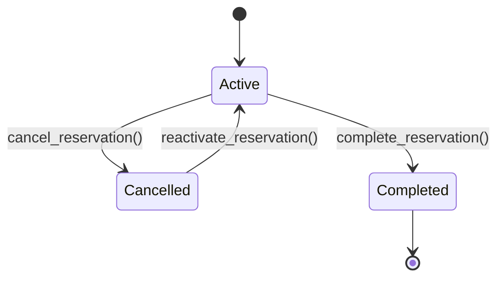
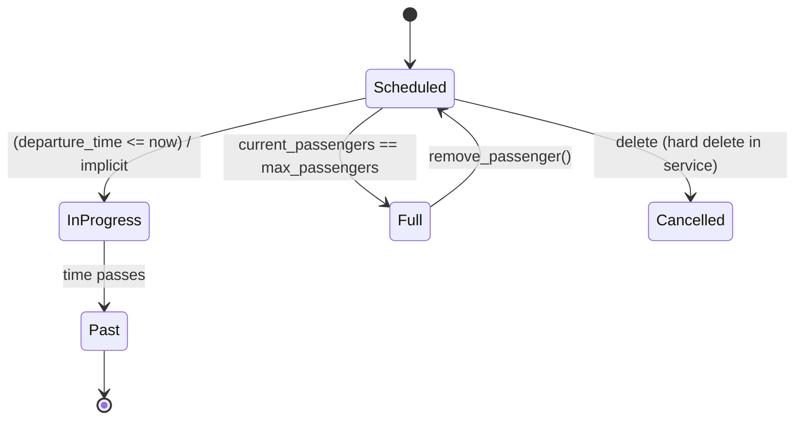

# Business Logic

This document summarizes observable use cases, rules, and lifecycle logic derived strictly from service and view code. Any inferred gap is noted explicitly.

## Use Cases

### 1. Create Parking Reservation
| Aspect | Detail |
|--------|--------|
| Actors | Authenticated User (role: user or administrator) |
| Preconditions | User is logged in; user.can_make_reservation() == True; target ParkingSpot exists and is `available`; date not double-booked |
| Trigger | POST form submission (`/reservations/new`) or API quick reservation (`POST /api/quick-reservation`) |
| Main Flow | Validate permissions → Validate spot exists & available → Check not already reserved for date → Create `Reservation` row → Commit → Log `reservation_created` via `Action` |
| Alternative | Spot unavailable → abort with error; Double-booking detected → error; User lacks permission → error |
| Postconditions | New reservation persisted; action log entry created |

Business Rules:
* No double booking per (spot_id, reservation_date) enforced through service query.
* Only future or today reservations can be created (implicit by user choices; explicit future checks in some flows).

### 2. Update Reservation
| Aspect | Detail |
|--------|--------|
| Actors | Reservation Owner or Administrator |
| Preconditions | Reservation exists; reservation.can_be_modified() == True |
| Trigger | POST to `/reservations/<id>/edit` |
| Main Flow | Ownership/admin check → Validate new spot (if provided) is available → Validate no double-book conflict (spot/date combo) → Apply attribute updates → Commit → Log `reservation_updated` |
| Postconditions | Reservation updated, audit entry persisted |
| Failure Modes | Past reservation; unauthorized user; target spot unavailable; double booking risk |

### 3. Cancel Reservation
| Actors | Reservation Owner or Administrator |
| Rule | Only future reservations (`reservation_date > today`) can be cancelled (service check) |
| Outcome | Row deleted, `reservation_cancelled` log entry |

### 4. Create Carpool Trip
| Preconditions | User.can_organize_carpool() == True; departure_time > now; (if return_time) return_time > departure_time |
| Outcome | Carpool persisted, `carpool_created` action |
| Failure | Past departure; invalid return; insufficient role |

### 5. Update Carpool Trip
| Authorization | Organizer or Admin |
| Constraints | Carpool.can_be_modified() (future trip) |
| Validation | Future departure; return_time > departure_time |
| Outcome | Fields changed via `update_details()`, `carpool_updated` action |

### 6. Delete Carpool Trip
| Authorization | Organizer or Admin |
| Outcome | Row deleted; log `carpool_deleted` |

### 7. Join Carpool (API)
| Preconditions | carpool.can_join(): has seats & future trip |
| Action | Increment `current_passengers` via `add_passenger()` → commit → log `carpool_joined` |
| Constraint | Capacity: `current_passengers < max_passengers` |

### 8. Leave Carpool (API)
| Action | Decrement passengers via `remove_passenger()` if > 0 → commit → log `carpool_left` |

### 9. Administrative: User Management
| Create | Admin creates user via `AdminService.create_user()`; logs admin_action |
| Update Role | Admin updates target role (`update_user_role`) with log entry |
| Delete User | Admin cannot delete self; cascades due to relationships (`delete-orphan`) |

### 10. Administrative: Parking Spot Management
| Create | Unique ID check; initial status 'available'; log entry |
| Update Status | Arbitrary transition accepted; log entry; (No rule forbidding reserved→available mid-use) |
| Delete | Blocked if any active/future reservations exist |

### 11. System Statistics Retrieval
Services aggregate counts (reservations, carpools, users, actions) on-demand for dashboards. No caching; potential performance hotspot at scale.

### 12. Authentication
| Flow | User submits credentials → `AuthService.authenticate_user()` → bcrypt password check → `login_user()` → log `user_login` |
| Logout | `logout_user_session()` → log `user_logout` |
| Registration | Valid uniqueness checks (username/email) → hash password → commit → log `user_created` |
| Change Password | Hash new password → commit → log `password_changed` |

## Business Rule Matrix
| Rule ID | Description | Enforced In |
|---------|-------------|-------------|
| R1 | Reservation requires available spot & no double booking | `ReservationService.create_reservation` |
| R2 | Reservation modification allowed only for future/today | `Reservation.can_be_modified()` + service guard |
| R3 | Reservation cancellation only for strictly future date | `Reservation.can_be_cancelled()` |
| R4 | Carpool creation requires future departure | `CarpoolService.create_carpool` |
| R5 | Carpool modification only for future trip | `Carpool.can_be_modified()` |
| R6 | Join carpool only if seats & future | `Carpool.can_join()` |
| R7 | Admin-only operations guarded by role check | Decorators & service role validations |
| R8 | Unique username/email | Queries in `AuthService.create_user` |
| R9 | Passwords always stored hashed | `AuthService.hash_password` |
| R10 | Parking spot delete blocked if active future reservations | `AdminService.delete_parking_spot` |

## State Lifecycles

### Reservation Status Lifecycle (Observed)
`status` column exists with values: active, cancelled, completed. Lifecycle mutators in model: `cancel_reservation`, `complete_reservation`, `reactivate_reservation`. However, services currently delete reservations on cancellation instead of using `cancel_reservation()`—inconsistency noted.

### Carpool Capacity / Temporal Logic

Note: No explicit status field—state inferred from time & counts.

## Validation & Error Handling Patterns
| Pattern | Description |
|---------|-------------|
| Permission First | Views check role/capability before service call (defense-in-depth with service re-checks). |
| Early Return | On validation failure (`None` / `False`) logs warning and returns error response or flash message. |
| Audit Coupling | Mutations always followed by `Action.log_*` invocation (reservation/car-pool/user/spot). |
| Transaction Boundary | Each service method opens implicit session; on exception: rollback & log error. |

## Derived KPIs (Computed On Demand)
| KPI | Source |
|-----|--------|
| Utilization Rate | `today_reservations / total_spots` in reservation stats |
| Carpool Occupancy | Aggregate passengers / capacity in `get_carpool_statistics` |
| Activity Trends | Count grouped by date in admin & API chart endpoints |

## Gaps / Questions (Evidence-Based)
* Inconsistent use of reservation `status` vs deletion on cancellation—should cancellations soft-update instead of delete? (Code currently deletes.)
* Carpool passenger membership implied (`carpool.passengers`) in some view code but no relationship defined in model—missing join table or legacy code fragment.
* No throttling for repeated login attempts (security consideration). 
* No explicit email verification or password reset token implementation (placeholder comment only).

All content above sourced from `services/*.py`, `views/*.py`, and model definitions. No undocumented external integrations observed.
