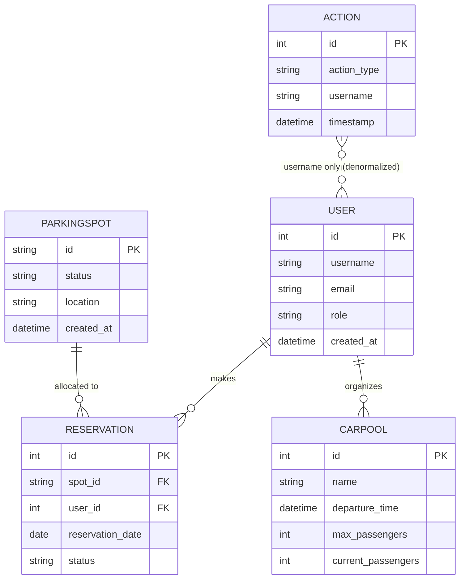

# Domain Model

All entities and relationships extracted from `carpool/models/*.py`. No undocumented fields added. Where code references missing structures (e.g., carpool passengers) it's flagged.

## Entities

### User (`users`)
| Field | Type | Constraints | Notes |
|-------|------|-------------|-------|
| id | Integer | PK | Auto increment |
| username | String(80) | unique, not null, indexed | Login identifier |
| email | String(120) | unique, not null, indexed | Contact + alt login |
| password_hash | String(255) | not null | Bcrypt hash stored |
| role | String(20) | not null, default 'user' | Values: administrator, user, guest |
| created_at | DateTime | not null, default utcnow | Creation timestamp |

Relationships:
* `reservations` (one-to-many) → Reservation.user
* `organized_carpools` (one-to-many) → Carpool.organizer

### ParkingSpot (`parking_spots`)
| Field | Type | Constraints | Notes |
|-------|------|-------------|-------|
| id | String(10) | PK | Identifier like A1/B2 |
| status | String(20) | not null, default 'available' | Enum-like: available/reserved/maintenance |
| location | String(100) | not null | Physical grouping |
| description | Text | nullable | Optional |
| created_at | DateTime | not null, default utcnow | Creation timestamp |

Relationships:
* `reservations` (one-to-many) → Reservation.parking_spot

### Reservation (`reservations`)
| Field | Type | Constraints | Notes |
|-------|------|-------------|-------|
| id | Integer | PK |  |
| spot_id | String(10) | FK→parking_spots.id, not null, indexed | Spot reserved |
| user_id | Integer | FK→users.id, not null, indexed | User owner |
| name | String(100) | not null | Human label |
| reservation_date | Date | not null, indexed | Target day |
| status | String(20) | not null, default 'active' | active / cancelled / completed (model mutators) |
| created_at | DateTime | not null, default utcnow |  |
| updated_at | DateTime | not null, auto on update |  |

Checks (logic):
* Double booking prevented by query inside `Reservation.check_double_booking()`.
* Mutability controlled by date comparison helpers.

### Carpool (`carpools`)
| Field | Type | Constraints | Notes |
|-------|------|-------------|-------|
| id | Integer | PK |  |
| name | String(100) | not null | Trip title |
| origin | String(200) | not null | Start location |
| destination | String(200) | not null | End location |
| departure_time | DateTime | not null | Start time |
| return_time | DateTime | nullable | Optional return |
| max_passengers | Integer | not null, default 4 | Capacity |
| current_passengers | Integer | not null, default 0 | Updated via add/remove |
| notes | Text | nullable | Extra info |
| organizer_id | Integer | FK→users.id, not null, indexed | Organizer reference |
| created_at | DateTime | not null, default utcnow |  |
| updated_at | DateTime | not null, auto on update |  |

Derived State Methods: `is_full`, `has_available_seats`, temporal checks (`is_future_trip` etc.).

Missing Relationship Notice: View code in `main.py` references `carpool.passengers` & `driver_id`/`title` fields which are NOT present in the Carpool model—indicates either legacy remnants or planned extension.

### Action (`actions`)
| Field | Type | Constraints | Notes |
|-------|------|-------------|-------|
| id | Integer | PK |  |
| action_type | String(50) | not null, indexed | Names like user_login, reservation_created |
| username | String(80) | not null, indexed | Actor identifier (not FK) |
| timestamp | DateTime | not null, default utcnow, indexed | Event time |
| details | Text | nullable | Extra context |

No foreign keys to user—denormalized for resilience & historical integrity if users deleted.

## Relationships Summary
| Parent | Child | Cardinality | FK | Deletion Behavior |
|--------|-------|-------------|----|------------------|
| User | Reservation | 1→N | reservations.user_id | cascade delete-orphan via relationship |
| User | Carpool | 1→N | carpools.organizer_id | cascade delete-orphan |
| ParkingSpot | Reservation | 1→N | reservations.spot_id | cascade delete-orphan |
| User (name copy) | Action | N/A (username copy) | -- | Not enforced |

## ER Diagram

## Data Integrity & Constraints (Logic-Level)
| Integrity Aspect | Mechanism |
|------------------|----------|
| Unique users | DB uniqueness on username/email |
| Prevent double booking | Query existence check before insert/update |
| Cascade cleanup | Relationship cascade delete-orphan on user↔(Reservation/Carpool) |
| Temporal validity (future trips) | Service-layer validation before create/update |
| Capacity enforcement | `Carpool.add_passenger()` guard vs `max_passengers` |

## Compliance / PII
Minimal PII (email). No encryption at rest beyond default DB. Passwords hashed (bcrypt). No explicit data retention or anonymization policies observed in code.

## Identified Gaps
* Missing passenger association table for carpools (referenced but absent).
* Actions not linked via FK to users (intentional or early design trade-off).
* Reservation `status` not consistently used by services (see business logic doc).

All content above is code-derived; no speculative fields added.
