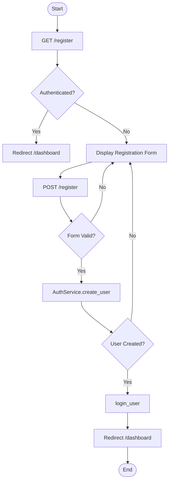
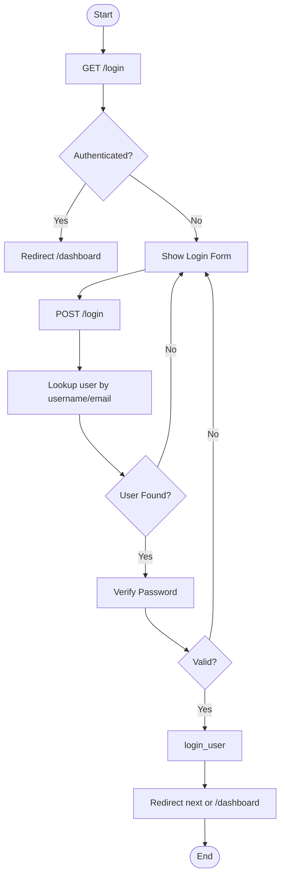
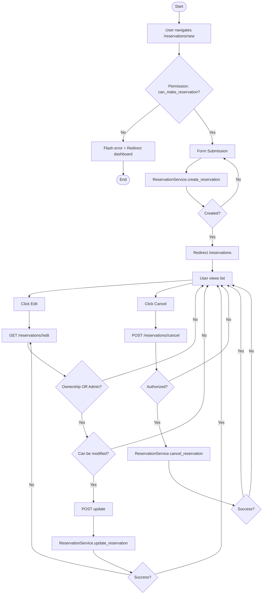
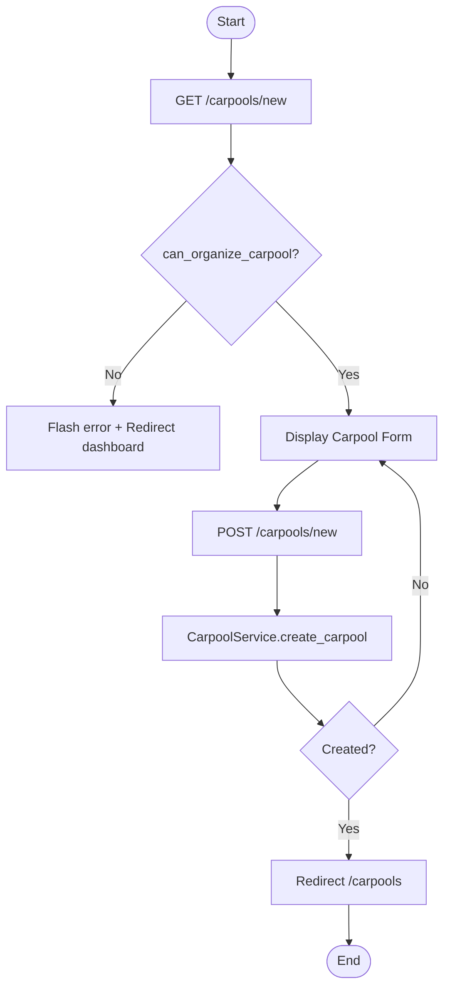
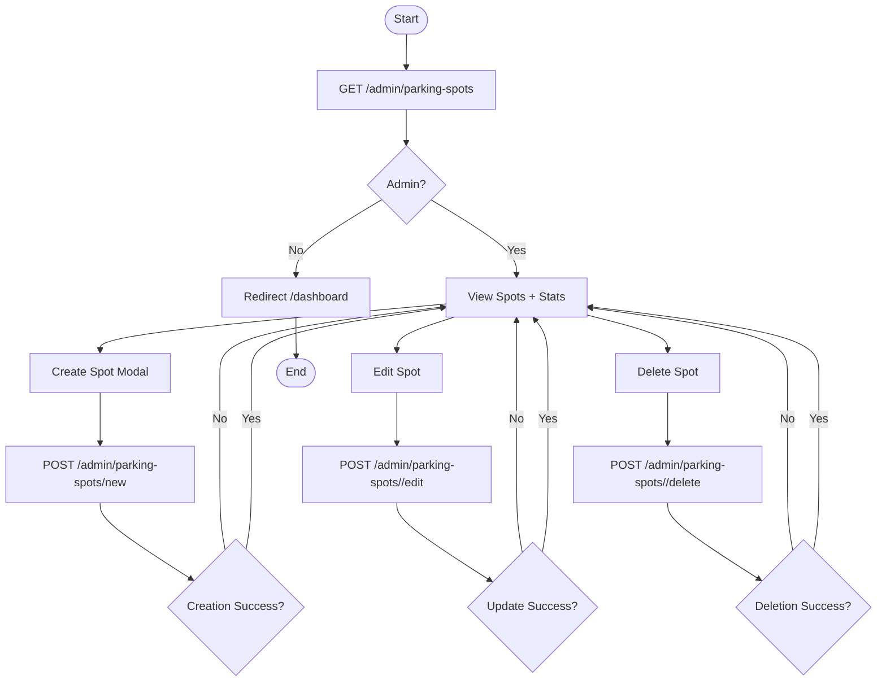
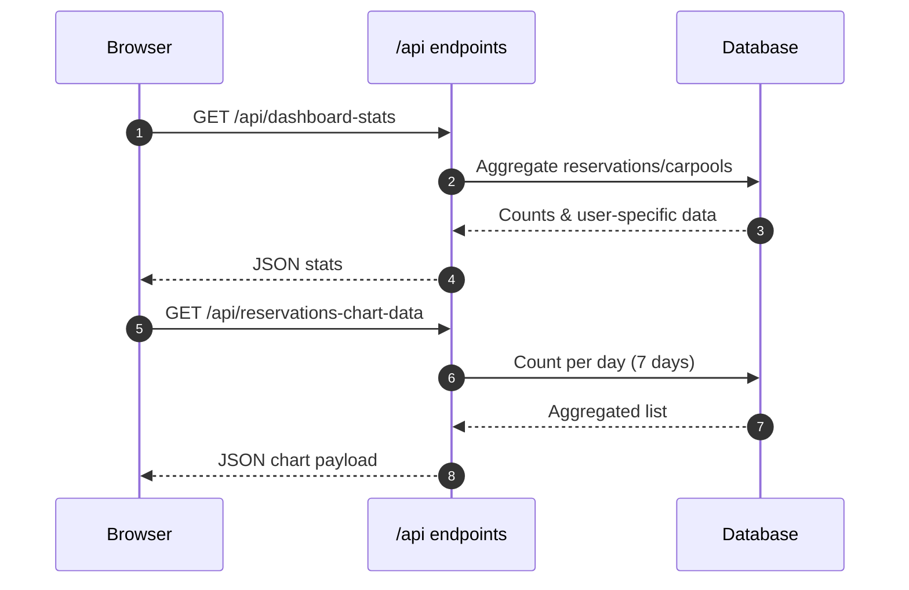

# User Flow Diagrams

All flows reconstructed strictly from existing route logic (`auth.py`, `main.py`, `api.py`, `admin.py`). Gaps are explicitly noted.

## Legend

| Symbol | Meaning |
|--------|---------|
| Rectangle | UI Page / Form |
| Parallelogram | User Input / Data Entry |
| Diamond | Decision / Branch |
| Cylinder | Database Persistence |
| Rounded | Start / End |

## Registration Flow



## Login Flow



## Reservation Lifecycle (Create / Edit / Cancel)



## Carpool Create Flow



## Carpool Join / Leave Flow (API)

NOTE: Passenger membership model not implemented; service logic uses counters only.

```mermaid
flowchart TD
  A([Start]) --> B[POST /api/carpool/{id}/join]
  B --> C[Get carpool]
  C --> D{Exists?}
  D -- No --> Z[404]
  D -- Yes --> E{carpool.can_join()?}
  E -- No --> Z[400]
  E -- Yes --> F[CarpoolService.join_carpool]
  F --> G{Success?}
  G -- No --> Z[400]
  G -- Yes --> H[Return JSON success + seats]
  H --> I([End])
  A --> J[POST /api/carpool/{id}/leave]
  J --> K[Get carpool]
  K --> L{Exists?}
  L -- No --> Z
  L -- Yes --> M[CarpoolService.leave_carpool]
  M --> N{Success?}
  N -- No --> Z
  N -- Yes --> O[Return JSON success + seats]
  O --> I
```

## Admin Parking Management Flow



## Dashboard Data Refresh (AJAX)



## Identified Flow Gaps

| Flow | Gap | Impact |
|------|-----|--------|
| Carpool passenger membership | No explicit table or relationship in model | Data integrity & seat tracking risk |
| Carpool cancel | Deletes entire record immediately | Potential audit loss beyond Action log |
| Reservation cancel | Depends on service (status vs delete) | Inconsistent historical reporting |

All diagrams and notes grounded in observed code; no speculative endpoints added.
