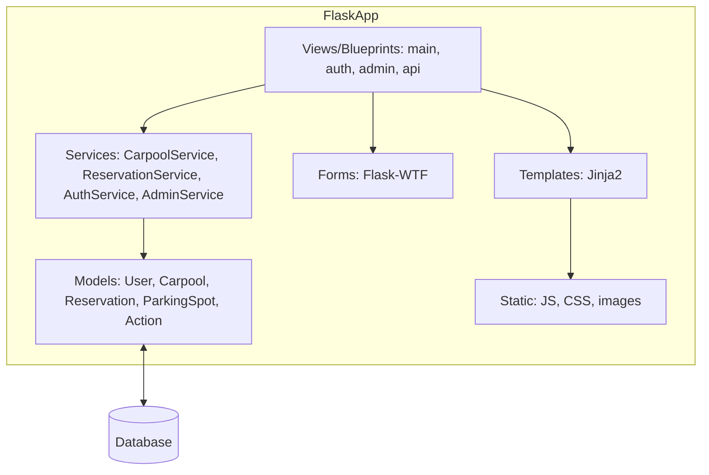

## Application Architecture Overview

### Application Type
Monolithic Flask web application using the MVC pattern with modular blueprints and a service layer.

### Module/Service Catalog

- `models`: SQLAlchemy ORM models for users, carpools, reservations, parking spots, and audit actions.
- `views`: Flask blueprints for route handling (admin, API, auth, main).
- `services`: Business logic for carpools, reservations, authentication, and admin operations.
- `forms`: Flask-WTF forms for input validation and CSRF protection.
- `templates`: Jinja2 templates for UI rendering.
- `static`: Static assets (CSS, JS, images).
- `extensions.py`: Flask extension instantiation (db, login, etc.).
- `config.py`: Environment-based configuration.
- `tests`: Unit and integration tests with fixtures and factories.

### Context Diagram

### Technology Stack

- **Backend**: Python 3.9+, Flask 2.x, Flask-RESTful, Flask-SQLAlchemy, Flask-Migrate, Flask-WTF, Flask-Login, Flask-Admin
- **Database**: PostgreSQL (production), SQLite (development/testing)
- **Frontend**: Jinja2, Chart.js, Bootstrap 5, jQuery 3.x, ES6+ JavaScript
- **Testing**: pytest, pytest-flask, factory-boy, coverage
- **Security**: Flask-Talisman, python-dotenv, environment-based secrets
- **Deployment**: Docker/Docker Compose (recommended)

### Directory Structure

- `carpool/models/`: ORM models
- `carpool/views/`: Blueprints (route handlers)
- `carpool/services/`: Business logic
- `carpool/forms/`: Form classes
- `carpool/templates/`: Jinja2 templates
- `carpool/static/`: Static files (CSS, JS)
- `config.py`: Configuration
- `extensions.py`: Flask extensions
- `tests/`: Unit and integration tests
- `migrations/`: Database migrations
