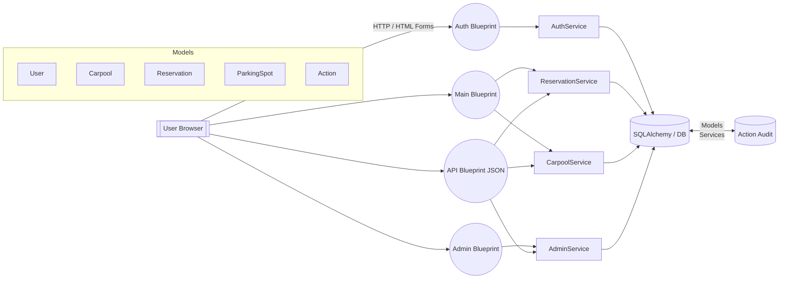

## Application Architecture Overview

### Application Type
Monolithic Flask web application with modular organization using Blueprints (auth, main, admin, api) and a service layer (auth_service, reservation_service, carpool_service, admin_service).

### Module / Blueprint Catalog
- config.py: Environment-specific settings and secrets.
- extensions.py: Central initialization of Flask extensions (SQLAlchemy, LoginManager, Migrate, CSRF, Talisman, Moment).
- carpool.models: ORM entities (User, Carpool, Reservation, ParkingSpot, Action).
- carpool.forms: Flask-WTF forms for authentication, reservations, carpools, admin.
- carpool.services: Business logic abstraction layer (auth, reservation, carpool, admin).
- carpool.views.auth (Blueprint /auth): Authentication / account views.
- carpool.views.main (Blueprint /): Core user dashboard, reservations, carpools, profile.
- carpool.views.admin (Blueprint /admin): Administrative management (users, parking, logs, system stats).
- carpool.views.api (Blueprint /api): JSON endpoints for dashboard/statistics, charts, AJAX, lightweight integrations.
- migrations/: Alembic migrations (schema evolution).
- tests/: Unit + integration tests (User model, authentication flows).
- static/, templates/: Presentation layer (Jinja2 templates, JS charts, styling).

### Technology Stack
- Backend Framework: Flask
- ORM: SQLAlchemy + Alembic migrations
- Forms & Validation: Flask-WTF / WTForms
- Auth: Flask-Login (session cookie)
- Security Enhancements: Flask-Talisman (CSP headers), CSRFProtect
- Password Hashing: bcrypt
- Time Helpers: Flask-Moment
- Database: SQLite (dev/testing) – adoptable to any SQLAlchemy-supported DB
- Frontend: Jinja2 templates + vanilla JS (charts, dynamic AJAX calls)
- Testing: pytest
- Environment Management: python-dotenv

### High-Level Interaction Flow
User (browser) → Flask (Blueprint routing) → Service Layer (transactional logic) → SQLAlchemy Models / DB → Response templated or JSON. Audit trail via `Action` model on significant operations.

### Notable Architectural Patterns
- Separation of Concerns: Views focus on request handling; services encapsulate business rules.
- Rich Domain Models: Entities expose helper/state methods (e.g., `Carpool.is_full()`, `Reservation.can_be_cancelled()`).
- Defensive Validation: Multi-layer checks (forms + services + model guards).
- Audit Logging: Centralized via `Action.log_*` static methods.
- Statistics Aggregation: Computed on-demand (no materialized reporting tables).
- Security Model: Role-based (administrator, user, guest) with decorators + conditional logic.

### Context Diagram (Module Interaction)

### Directory Structure (Key Paths)
- `carpool/models/`: Data schema + entity behaviors
- `carpool/services/`: Business logic orchestration
- `carpool/forms/`: Input validation / UX forms
- `carpool/views/`: Web + API endpoints grouped by responsibility
- `migrations/`: Alembic version scripts
- `tests/`: Unit (model) + integration (auth) coverage
- `static/js/`: Chart endpoints consumption & dashboard interactivity

### Architectural Observations / Inconsistencies
- Some legacy code paths in `main.py` (join/leave carpool referencing `carpool.passengers`, `driver_id`) do not match current `Carpool` model (no passenger relation). Current service layer uses numeric counters only. Recommend reconciliation.
- No explicit rate limiting, email service placeholders not implemented.
- Carpool passenger *identity* not persisted—only counts—restricts accountability and auditing granularity.

### Extension Initialization & Security
- Conditional CSP via Talisman (only when not in debug).
- CSRF enforced on forms (disabled in testing config).
- Session-based auth (no JWT / token endpoints currently).

### Deployment / Environment
- Config-driven via environment variables (SECRET_KEY, DATABASE_URL).
- Default SQLite; can scale by updating `SQLALCHEMY_DATABASE_URI`.
- HTTPS hardening (Talisman) flagged for production (force_https=False currently).
