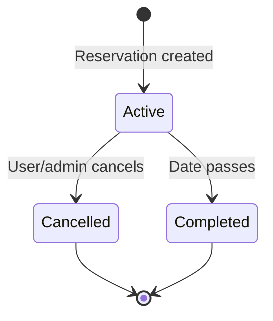

## Business Logic & Functional Requirements

### 1. Organize a Carpool Trip
- **Actors**: Registered user (organizer)
- **Flow**:
  1. User submits carpool creation form.
  2. System validates user permissions and trip details.
  3. CarpoolService creates a new Carpool record.
  4. Organizer is linked to the carpool.
- **Business Rules**:
  - Only users with permission can organize carpools.
  - Departure time must be in the future.
  - Return time (if provided) must be after departure.
- **Validation**:
  - Input validation via Flask-WTF.
  - Permission check in service layer.

### 2. Reserve a Parking Spot
- **Actors**: Registered user
- **Flow**:
  1. User selects a parking spot and date.
  2. System checks spot availability.
  3. ReservationService creates a Reservation.
  4. User receives confirmation.
- **Business Rules**:
  - One reservation per user per date.
  - Spot must be available.
- **Validation**:
  - Date must not be in the past.
  - Spot must not be reserved.

### 3. Join/Leave a Carpool
- **Actors**: Registered user
- **Flow**:
  1. User requests to join/leave a carpool.
  2. System checks carpool capacity and user eligibility.
  3. Updates carpool passenger list.
- **Business Rules**:
  - Cannot join if carpool is full.
  - Cannot join same carpool twice.

### 4. Administer Users, Carpools, Reservations
- **Actors**: Administrator
- **Flow**:
  1. Admin accesses dashboard.
  2. Views, edits, or deletes users, carpools, reservations.
  3. Actions are logged in Action model.
- **Business Rules**:
  - Only admins can access admin routes.
  - All admin actions are audited.

### 5. View Dashboard & Statistics
- **Actors**: All authenticated users
- **Flow**:
  1. User accesses dashboard.
  2. AJAX call to `/api/dashboard-stats`.
  3. System aggregates and returns statistics.
- **Business Rules**:
  - Only authenticated users can view dashboard.

### Entity Lifecycle Example

