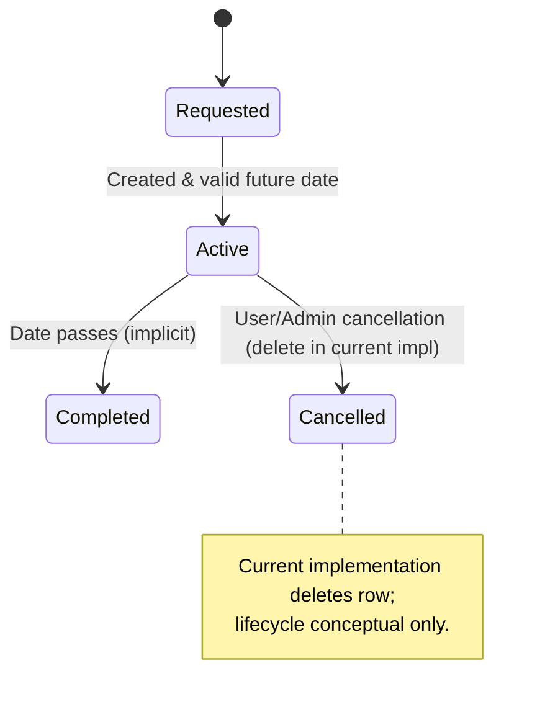

## Business Logic & Functional Requirements

### Use Case 1: User Registration
- Actors: Anonymous User
- Steps:
  1. Navigate to /auth/register
  2. Submit username, email, password, confirmation
  3. System validates uniqueness (form validators)
  4. `AuthService.create_user` hashes password, persists user with default role=user
  5. User optionally auto-logged-in
  6. Redirect to dashboard
- Business Rules:
  - Username & email must be unique.
  - Default role = user (not guest).
- Validation Rules:
  - Username length 3–80.
  - Password length ≥ 6; confirmation match.
  - Email format valid.
- Lifecycle: User becomes active immediately (no email confirmation implemented).

### Use Case 2: User Login
- Actors: Registered User
- Steps:
  1. Access /auth/login
  2. Provide username or email + password
  3. Lookup by username else email
  4. `AuthService.authenticate_user` verifies bcrypt hash
  5. `login_user_session` sets session; `Action.log_login`
  6. Redirect to next or /dashboard
- Business Rules:
  - Incorrect credentials produce generic error (avoid enumeration).
- Validation:
  - Required fields; length constraints.
  - CSRF token required (except testing).

### Use Case 3: Change Password
- Actors: Authenticated User
- Steps:
  1. Go to /auth/change-password
  2. Enter current + new + confirm
  3. Verify current password
  4. Hash and persist new password
  5. Log action
- Rules: New password must differ (not enforced in code—potential enhancement).
- Validation: Minimum length; matching confirmation.

### Use Case 4: Parking Spot Reservation
- Actors: User, Admin
- Steps:
  1. Visit /reservations/new
  2. Form shows only available spot IDs (status=available)
  3. User selects date (future or today) + spot + name
  4. Service checks permission, spot existence, availability, double booking
  5. Persist reservation + log action
  6. Show confirmation
- Business Rules:
  - No double booking per spot + date.
  - Users can only create if role in {user, administrator}.
  - Date cannot be past.
- Validation:
  - Form-level spot existence and availability.
  - Service-level conflict check.

### Use Case 5: Edit Reservation
- Actors: Owner User, Admin
- Steps:
  1. GET /reservations/{id}/edit
  2. Validate ownership or admin privilege
  3. Only future or today reservations editable
  4. Change name / spot / date (each revalidated)
  5. Log update
- Business Rules:
  - Past reservations immutable.
  - Spot/date change re-checks double booking.
- Validation:
  - Ownership or admin.
  - New spot must be available (unless current).

### Use Case 6: Cancel Reservation
- Actors: Owner User, Admin
- Steps:
  1. POST /reservations/{id}/cancel
  2. Validate ownership/admin + future date
  3. Delete (not soft status change) then log
- Rule: Only future reservations cancellable.
- Note: Deletion removes historical trace except audit action.

### Use Case 7: Create Carpool
- Actors: User, Admin
- Steps:
  1. /carpools/new
  2. Provide details incl. future departure time
  3. Service validates times & permissions
  4. Persist with current_passengers=0, log
- Rules:
  - Departure must be in future.
  - Return (if provided) > departure.
- Validation:
  - Capacity 1–8.
  - Name & location lengths.

### Use Case 8: Update Carpool
- Actors: Organizer, Admin
- Steps:
  1. Load existing carpool
  2. Validate future trip & ownership/admin
  3. Adjust fields (capacity may truncate current_passengers overflow)
  4. Commit & log
- Rules:
  - Past carpools immutable.

### Use Case 9: Join / Leave Carpool (Service API)
- Actors: User
- Steps:
  - Join: ensure `can_join()` (future and seats) → increment counter.
  - Leave: decrement counter if > 0.
- Rules:
  - No over-capacity.
  - No joining past trips.
- Limitation:
  - No persistence of which users joined (only count). Audit partially mitigates this gap.

### Use Case 10: Admin Manage Users
- Actors: Admin
- Actions:
  - Create: sets role, logs `admin_action`.
  - Update Role: role transitions logged.
  - Delete: prevents self-deletion.
- Rules:
  - Only administrator role can perform these operations.

### Use Case 11: Admin Parking Management
- Actors: Admin
- Actions:
  - Create spot (ID uniqueness).
  - Update status (available/reserved/maintenance).
  - Delete only if no future reservations.
- Rules:
  - Status drives availability logic for reservations.

### Use Case 12: System Statistics & Dashboards
- Actors: User, Admin
- Steps:
  - Aggregation via service layer methods.
  - Charts query counts over sliding windows (7-day trends).
- Rules:
  - Real-time queries (no caching layer).

### Use Case 13: Audit Logging
- Events Logged:
  - user_login/logout
  - reservation_created/updated/cancelled
  - carpool_created/updated/deleted
  - admin_action
- Purpose:
  - Traceability & minimal forensic trail.

### Use Case 14: Quick Reservation (API)
- Steps:
  1. POST /api/quick-reservation with name + spot_id
  2. Fixes date = today
  3. Validates availability & permissions
- Rules:
  - Single-day ephemeral convenience action.

### Use Case 15: Profile Update
- Actors: Authenticated User
- Steps:
  - Update username/email (uniqueness enforced).
  - Action logged via manual Action instantiation (includes IP / User-Agent in code branch referencing non-existent fields—requires schema update).
- Inconsistency:
  - Action model lacks fields referenced (ip_address, user_agent).

### Entity Lifecycle Example (Reservation)

### General Business Rules Summary
- Time-Based Immutability: Past reservations/carpools locked.
- Double Booking Prevention: Reservation uniqueness per (spot_id, date).
- Capacity Enforcement: current_passengers ≤ max_passengers.
- Role-Based Permissions: Admin supersedes ownership checks.
- Security Logging: All critical mutations generate Action entries.

### Validation Layering
- Forms (syntactic/user feedback)
- Services (authorization & business constraints)
- Models (semantic helpers only; minimal hard constraints beyond schema)

### Assumptions / Gaps
- No email verification or password reset token implementation.
- Carpool passenger identity tracking incomplete.
- Action model missing referenced extra fields (ip_address, user_agent).
- No rate limiting / brute-force mitigation.
