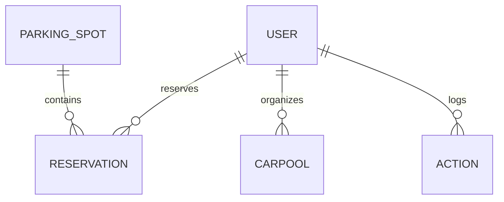

## Database Structure & Schema

### Database Type
SQLite (development/testing). Portable to PostgreSQL/MySQL by swapping `SQLALCHEMY_DATABASE_URI`.

### Connection Configuration
- URI from `DATABASE_URL` env var or fallback `sqlite:///carpool.db`.
- SQLAlchemy session managed via Flask app context.
- Migrations: Alembic (single migration present).

### Tables

#### users
| Column | Type | Constraints | Notes |
| ------ | ---- | ----------- | ----- |
| id | Integer | PK | Auto increment |
| username | String(80) | Unique, Not Null, Indexed | Login identifier |
| email | String(120) | Unique, Not Null, Indexed | Contact & credential |
| password_hash | String(255) | Not Null | bcrypt hash |
| role | String(20) | Default 'user', Not Null | administrator/user/guest |
| created_at | DateTime | Not Null, default utcnow | Creation timestamp |

Indexes: (username), (email)

#### carpools
| Column | Type | Constraints | Notes |
| id | Integer | PK |  |
| name | String(100) | Not Null | Title |
| origin | String(200) | Not Null | Start location |
| destination | String(200) | Not Null | End location |
| departure_time | DateTime | Not Null | Future required |
| return_time | DateTime | Nullable | Must be > departure |
| max_passengers | Integer | Not Null | Default 4 |
| current_passengers | Integer | Not Null | Increment/decrement only |
| notes | Text | Nullable | Free-form |
| organizer_id | Integer | FK → users.id, Not Null, Indexed | Owner |
| created_at | DateTime | Not Null | Default utcnow |
| updated_at | DateTime | Not Null | auto on update |

#### parking_spots
| Column | Type | Constraints | Notes |
| id | String(10) | PK | Human-readable (e.g., A1) |
| status | String(20) | Not Null, default 'available' | available/reserved/maintenance |
| location | String(100) | Not Null | Semantic zone |
| description | Text | Nullable | Descriptive |
| created_at | DateTime | Not Null | Default utcnow |

#### reservations
| Column | Type | Constraints | Notes |
| id | Integer | PK |  |
| spot_id | String(10) | FK → parking_spots.id, Indexed | |
| user_id | Integer | FK → users.id, Indexed | |
| name | String(100) | Not Null | Purpose label |
| reservation_date | Date | Not Null, Indexed | Single-date slot |
| status | String(20) | Not Null, default 'active' | Added by migration |
| created_at | DateTime | Not Null | Default utcnow |
| updated_at | DateTime | Not Null | auto on update |

#### actions
| Column | Type | Constraints | Notes |
| id | Integer | PK |  |
| action_type | String(50) | Indexed, Not Null | Category |
| username | String(80) | Indexed, Not Null | Denormalized |
| timestamp | DateTime | Indexed, Not Null | Default utcnow |
| details | Text | Nullable | Verbose context |

### Migration Strategy
- Alembic managed.
- Example migration: Adds `status` column to `reservations` with server default 'active'.
- Future recommended migrations:
  - Add passenger association table for carpools.
  - Add fields to `Action` for IP/user agent if required by profile update logic.

### Data Seeding
- No formal seed scripts; admin credentials via env variables.
- Potential improvement: CLI seed command for initial spots/users.

### Performance Considerations
- High-read endpoints (charts) rely on COUNT queries—acceptable for small-medium scale.
- Add composite index (`(spot_id, reservation_date)`) for double booking check (currently implicit).
- Consider partial index on reservations where status='active' if status semantics grow.

### Database Constraints & Rules
- Uniqueness: username, email.
- Referential: FK spot_id, user_id, organizer_id.
- Application-level:
  - Prevent overcapacity (service logic).
  - Prevent past modifications.
  - Avoid double booking.

### Proposed ER Diagram

### Triggers / Stored Procedures
- None (all logic in Python services).

### Gaps / Risks
- Hard delete of reservations loses historical thread (rely on Action).
- Action table lacks structured indexing for analytics beyond counts.
- No transactional retry logic for potential race (double booking window) — race unlikely at low concurrency but possible.
