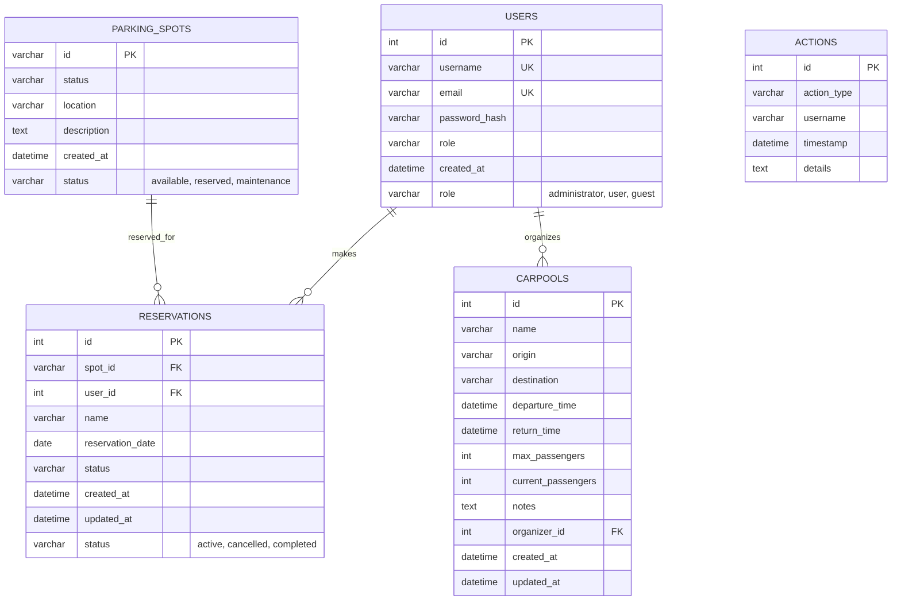

# Database Structure & Schema

## Database Type

The application uses **SQLite** as the default database system for development and **PostgreSQL** for production environments. The database configuration is handled through SQLAlchemy ORM with Flask-SQLAlchemy extension.

- **Development**: SQLite 3.x (`sqlite:///carpool.db`)
- **Production**: PostgreSQL (configurable via `DATABASE_URL` environment variable)
- **Testing**: In-memory SQLite (`sqlite:///:memory:`)

## Connection Configuration

Database connections are configured through the `Config` class in `config.py`:

```python
SQLALCHEMY_DATABASE_URI = os.environ.get('DATABASE_URL') or 'sqlite:///carpool.db'
SQLALCHEMY_TRACK_MODIFICATIONS = False
```

The application uses SQLAlchemy's connection pooling and automatic connection management. Database connections are established through Flask-SQLAlchemy's `db` instance defined in `extensions.py`.

## Table Structure

### Users Table (`users`)

**Purpose**: Manages user accounts with authentication and role-based access control.

| Column | Data Type | Constraints | Description |
|--------|-----------|-------------|-------------|
| id | INTEGER | PRIMARY KEY, AUTO INCREMENT | Unique user identifier |
| username | VARCHAR(80) | UNIQUE, NOT NULL, INDEXED | User's login username |
| email | VARCHAR(120) | UNIQUE, NOT NULL, INDEXED | User's email address |
| password_hash | VARCHAR(255) | NOT NULL | Hashed password for authentication |
| role | VARCHAR(20) | NOT NULL, DEFAULT 'user' | User role (administrator, user, guest) |
| created_at | DATETIME | NOT NULL, DEFAULT CURRENT_TIMESTAMP | Account creation timestamp |

**Indexes**:

- `ix_users_username` (username)
- `ix_users_email` (email)

**Business Rules**:

- Username and email must be unique across the system
- Role determines access permissions (administrator > user > guest)
- Password is stored as hash for security

### Parking Spots Table (`parking_spots`)

**Purpose**: Manages individual parking locations and their availability status.

| Column | Data Type | Constraints | Description |
|--------|-----------|-------------|-------------|
| id | VARCHAR(10) | PRIMARY KEY | Unique spot identifier (e.g., A1, B2) |
| status | VARCHAR(20) | NOT NULL, DEFAULT 'available' | Current status (available, reserved, maintenance) |
| location | VARCHAR(100) | NOT NULL | Physical location description |
| description | TEXT | NULLABLE | Optional additional spot information |
| created_at | DATETIME | NOT NULL, DEFAULT CURRENT_TIMESTAMP | Spot creation timestamp |

**Business Rules**:

- Spot ID follows alphanumeric format (e.g., A1, B2, C10)
- Status controls availability for reservations
- Maintenance status prevents new reservations

### Reservations Table (`reservations`)

**Purpose**: Links users to parking spots for specific dates with status tracking.

| Column | Data Type | Constraints | Description |
|--------|-----------|-------------|-------------|
| id | INTEGER | PRIMARY KEY, AUTO INCREMENT | Unique reservation identifier |
| spot_id | VARCHAR(10) | FOREIGN KEY, NOT NULL, INDEXED | References parking_spots.id |
| user_id | INTEGER | FOREIGN KEY, NOT NULL, INDEXED | References users.id |
| name | VARCHAR(100) | NOT NULL | Reservation name/description |
| reservation_date | DATE | NOT NULL, INDEXED | Date of the reservation |
| status | VARCHAR(20) | NOT NULL, DEFAULT 'active' | Reservation status (active, cancelled, completed) |
| created_at | DATETIME | NOT NULL, DEFAULT CURRENT_TIMESTAMP | Reservation creation timestamp |
| updated_at | DATETIME | NOT NULL, DEFAULT CURRENT_TIMESTAMP, ON UPDATE CURRENT_TIMESTAMP | Last modification timestamp |

**Indexes**:

- `ix_reservations_spot_id` (spot_id)
- `ix_reservations_user_id` (user_id)  
- `ix_reservations_reservation_date` (reservation_date)

**Foreign Keys**:

- `spot_id` → `parking_spots.id` (CASCADE DELETE)
- `user_id` → `users.id` (CASCADE DELETE)

**Business Rules**:

- One reservation per spot per date (prevents double booking)
- Future reservations can be modified or cancelled
- Past reservations are marked as completed

### Carpools Table (`carpools`)

**Purpose**: Manages carpool trip organization with passenger capacity tracking.

| Column | Data Type | Constraints | Description |
|--------|-----------|-------------|-------------|
| id | INTEGER | PRIMARY KEY, AUTO INCREMENT | Unique carpool identifier |
| name | VARCHAR(100) | NOT NULL | Carpool trip name |
| origin | VARCHAR(200) | NOT NULL | Starting location |
| destination | VARCHAR(200) | NOT NULL | Destination location |
| departure_time | DATETIME | NOT NULL | Trip departure time |
| return_time | DATETIME | NULLABLE | Optional return time |
| max_passengers | INTEGER | NOT NULL, DEFAULT 4 | Maximum passenger capacity |
| current_passengers | INTEGER | NOT NULL, DEFAULT 0 | Current passenger count |
| notes | TEXT | NULLABLE | Additional trip information |
| organizer_id | INTEGER | FOREIGN KEY, NOT NULL, INDEXED | References users.id |
| created_at | DATETIME | NOT NULL, DEFAULT CURRENT_TIMESTAMP | Carpool creation timestamp |
| updated_at | DATETIME | NOT NULL, DEFAULT CURRENT_TIMESTAMP, ON UPDATE CURRENT_TIMESTAMP | Last modification timestamp |

**Indexes**:

- `ix_carpools_organizer_id` (organizer_id)

**Foreign Keys**:

- `organizer_id` → `users.id` (CASCADE DELETE)

**Business Rules**:

- Current passengers cannot exceed maximum capacity
- Only future trips can be modified
- Organizer can manage trip details and passenger count

### Actions Table (`actions`)

**Purpose**: System audit logging for tracking all user activities and system events.

| Column | Data Type | Constraints | Description |
|--------|-----------|-------------|-------------|
| id | INTEGER | PRIMARY KEY, AUTO INCREMENT | Unique action identifier |
| action_type | VARCHAR(50) | NOT NULL, INDEXED | Type of action performed |
| username | VARCHAR(80) | NOT NULL, INDEXED | User who performed the action |
| timestamp | DATETIME | NOT NULL, DEFAULT CURRENT_TIMESTAMP, INDEXED | Action timestamp |
| details | TEXT | NULLABLE | Additional action details |

**Indexes**:

- `ix_actions_action_type` (action_type)
- `ix_actions_username` (username)
- `ix_actions_timestamp` (timestamp)

**Business Rules**:

- All user actions are logged for audit purposes
- Action types include: user_login, user_logout, reservation_created, carpool_created, admin_action, etc.
- Immutable audit trail (no updates or deletes)

## Mermaid ERD



## Migration Strategy

Database schema changes are managed using Flask-Migrate (Alembic):

- **Migration Files**: Located in `migrations/versions/`
- **Current Migration**: `bf20dc5ca70c_add_status_column_to_reservations_table.py`
- **Commands**:
  - `flask db init` - Initialize migration repository
  - `flask db migrate -m "message"` - Generate new migration
  - `flask db upgrade` - Apply pending migrations
  - `flask db downgrade` - Rollback migrations

### Migration History

1. **bf20dc5ca70c** (2025-06-26): Added status column to reservations table
   - Added `status` column with default value 'active'
   - Enables reservation lifecycle management

## Data Seeding

Initial data setup is handled through `setup_initial_data()` function in `database.py`:

- **Admin User**: Created from environment variables
- **Sample Parking Spots**: Initial parking spots (A1-A10, B1-B10, etc.)
- **Default Roles**: Ensures proper role structure

## Performance Considerations

### Indexing Strategy

- **Primary Keys**: Automatic indexes on all ID columns
- **Foreign Keys**: Indexed for JOIN performance
- **Search Columns**: Username, email, reservation_date indexed
- **Audit Queries**: Action_type, username, timestamp indexed

### Query Optimization

- **Eager Loading**: Relationships configured with appropriate lazy loading
- **Cascade Operations**: Proper CASCADE DELETE for data integrity
- **Connection Pooling**: SQLAlchemy handles connection management
- **Query Batching**: Bulk operations for data-intensive tasks

## Database Constraints & Rules

### Business Rules Enforced at Database Level

1. **Unique Constraints**:
   - Username uniqueness across users
   - Email uniqueness across users
   - Parking spot ID uniqueness

2. **Foreign Key Constraints**:
   - Reservation must reference valid user and parking spot
   - Carpool must reference valid organizer
   - CASCADE DELETE maintains referential integrity

3. **Check Constraints** (Application Level):
   - Passenger count cannot exceed maximum capacity
   - Reservation date cannot be in the past (for new reservations)
   - User roles limited to predefined values

4. **Default Values**:
   - User role defaults to 'user'
   - Parking spot status defaults to 'available'
   - Reservation status defaults to 'active'
   - Timestamps default to current time

### Data Integrity Rules

- **Double Booking Prevention**: Application-level check for spot availability
- **Audit Trail**: All user actions logged in actions table
- **Soft Deletes**: Status-based deactivation instead of hard deletes
- **Timestamp Tracking**: Created and updated timestamps on all entities

## Security Considerations

- **Password Storage**: Passwords stored as hashes, never plain text
- **SQL Injection Prevention**: SQLAlchemy ORM with parameterized queries
- **Role-Based Access**: Database-level role enforcement
- **Audit Logging**: Complete audit trail for security monitoring
- **Environment Variables**: Sensitive configuration externalized

## Backup and Recovery

- **Development**: SQLite database files backed up regularly
- **Production**: PostgreSQL backup strategy with point-in-time recovery
- **Migration Safety**: All migrations tested and reversible
- **Data Export**: JSON export functionality for data portability
