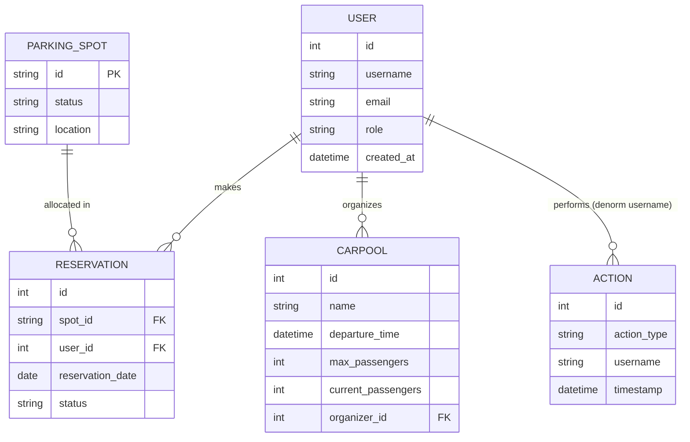

## Domain Data Model

### Entities Overview
| Entity | Description | Key Attributes (name:type:constraints) |
| ------ | ----------- | -------------------------------------- |
| User | System account & role holder | id:int:pk; username:str(80):unique idx; email:str(120):unique idx; password_hash:str(255):required; role:str(20):default 'user'; created_at:datetime |
| Carpool | Organized shared trip | id:int:pk; name:str(100); origin:str(200); destination:str(200); departure_time:datetime; return_time:datetime?; max_passengers:int:default4; current_passengers:int:default0; notes:text?; organizer_id:int:fk(users.id); created_at, updated_at:datetime |
| ParkingSpot | Reservable parking location | id:str(10):pk; status:str(20):default 'available'; location:str(100); description:text?; created_at:datetime |
| Reservation | Parking reservation record | id:int:pk; spot_id:str(10):fk(parking_spots.id); user_id:int:fk(users.id); name:str(100); reservation_date:date:index; status:str(20):default 'active'; created_at, updated_at:datetime |
| Action | Audit log entry | id:int:pk; action_type:str(50):index; username:str(80):index; timestamp:datetime:index; details:text? |

### Relationships
- User 1—* Reservation (user.reservations)
- User 1—* Carpool (user.organized_carpools → organizer)
- ParkingSpot 1—* Reservation
- Action * (independent; denormalized `username` not FK for resilience)
- (Missing) Carpool passengers association (currently implied only by counters)

### Mermaid ER Diagram

### Database Schema (Logical)
- users(username, email) indexed unique
- reservations(reservation_date index, spot_id fk, user_id fk)
- parking_spots(status, location)
- carpools(organizer_id fk, departure_time, updated_at)
- actions(action_type index, timestamp index, username index)

### Data Access Patterns
- Services use filtered queries with ordering for dashboards.
- Double booking check: query where (spot_id, reservation_date) and optional exclusion.
- Statistics: count aggregation queries per date or status grouping.
- No heavy prefetching; simple lazy relationships adequate for scale assumptions.

### Integrity & Constraints
- Foreign keys at ORM-level (enforced by DB backend if supported).
- Uniqueness on username/email ensures identity consistency.
- Business rule constraints (capacity, temporal validation) enforced in service layer (not at DB).

### Missing / Potential Enhancements
- Carpool passenger association table (carpool_passengers: carpool_id, user_id, joined_at).
- Soft delete or status field for reservations instead of hard delete on cancellation.
- Action table extension for structured metadata (IP, user agent).

### Data Retention / Compliance (Assumed)
- No PII beyond email; password hashed (bcrypt).
- Audit logs retained indefinitely (no purge policy specified).

### Performance Considerations
- Simple counts; consider indexes on:
  - reservations (spot_id, reservation_date)
  - carpools (departure_time)
  - actions (timestamp, action_type)
- For scale: materialized daily summaries could reduce dashboard latency.

### Assumptions
- SQLite dev: Foreign key constraints require PRAGMA enforcement (not shown).
- Migration history currently single (adding status column) → early lifecycle stage.
