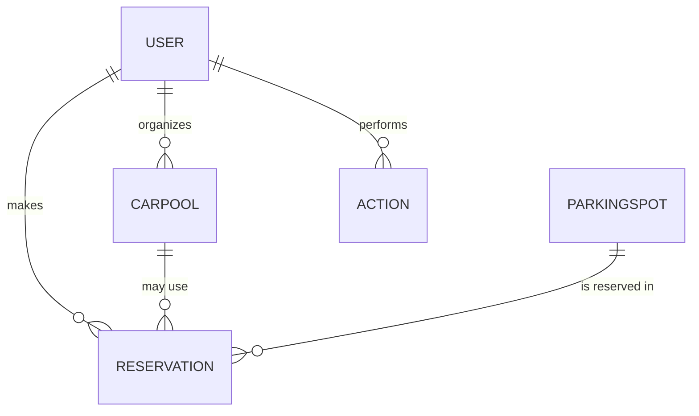

## Domain Data Model

### Entity Table

| Entity        | Description                        | Key attributes (name:type:constraints)                                   |
|---------------|------------------------------------|-------------------------------------------------------------------------|
| User          | System user                        | id:int:pk, username:str:unique, email:str:unique, password_hash:str, role:str, created_at:datetime |
| Carpool       | Carpool trip                       | id:int:pk, name:str, origin:str, destination:str, departure_time:datetime, return_time:datetime, max_passengers:int, current_passengers:int, notes:str, organizer_id:int:fk, created_at:datetime |
| Reservation   | Parking spot reservation           | id:int:pk, spot_id:str:fk, user_id:int:fk, name:str, reservation_date:date, status:str, created_at:datetime |
| ParkingSpot   | Parking location                   | id:str:pk, status:str, location:str, description:str, created_at:datetime |
| Action        | Audit log entry                    | id:int:pk, action_type:str, username:str, timestamp:datetime, details:str |

### Relationships

- User 1---* Reservation (user can have many reservations)
- User 1---* Carpool (user can organize many carpools)
- Carpool 1---* Reservation (carpool may be linked to reservations for parking)
- ParkingSpot 1---* Reservation (spot can have many reservations)
- Action *---1 User (actions reference users by username)

### Mermaid ER Diagram

### Database Schema

- All tables use SQLAlchemy ORM with primary keys, foreign keys, and indexes.
- Constraints: unique (username, email), not null, default values, cascading deletes on relationships.
- Data retention: Audit logs (Action) for monitoring; no explicit retention policy found.

### Data Access Patterns

- Data is accessed via service layer (e.g., CarpoolService, ReservationService).
- Views/blueprints call services, which interact with models and commit via SQLAlchemy.
- API endpoints return JSON for AJAX/frontend use.
