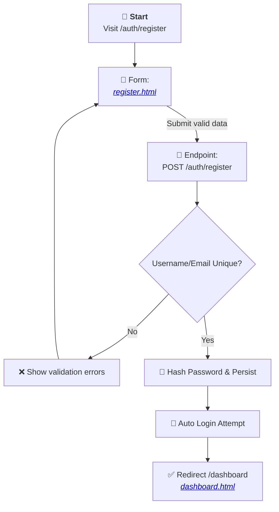
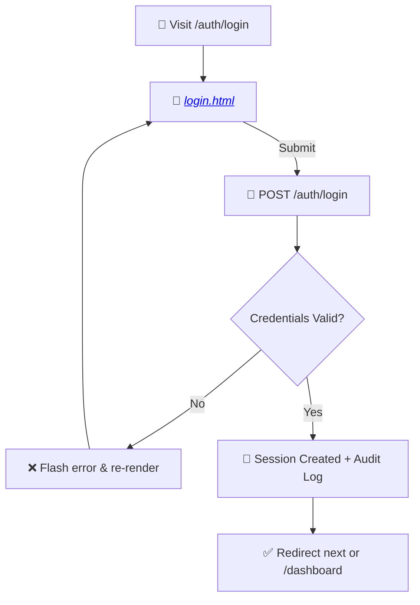
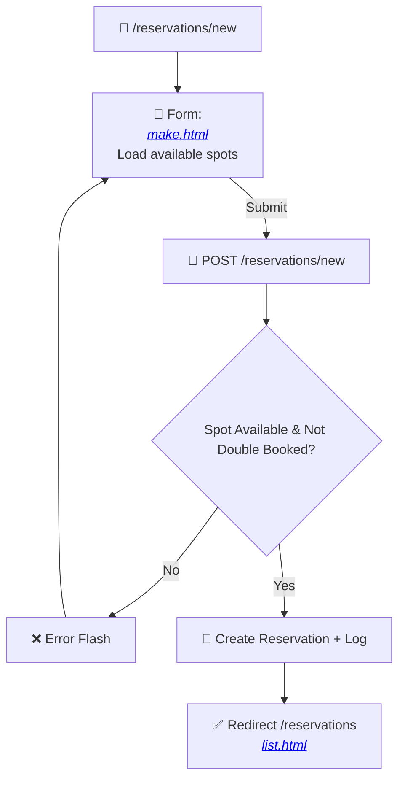
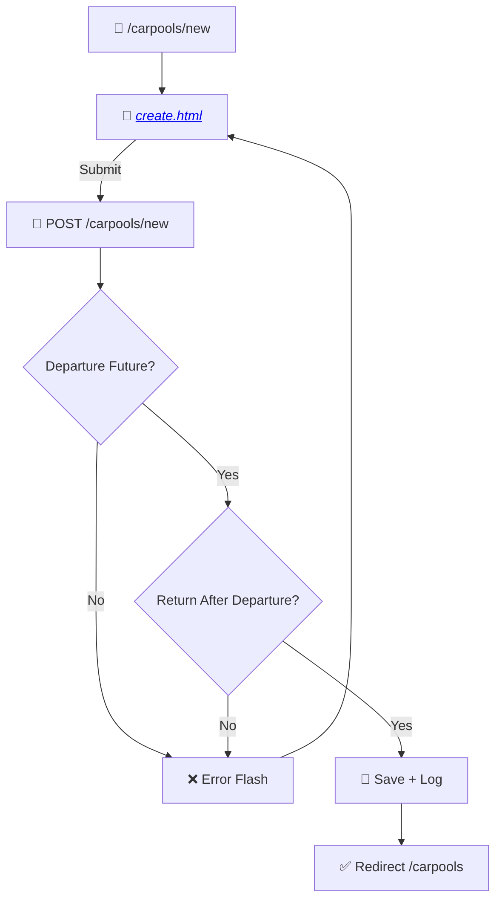
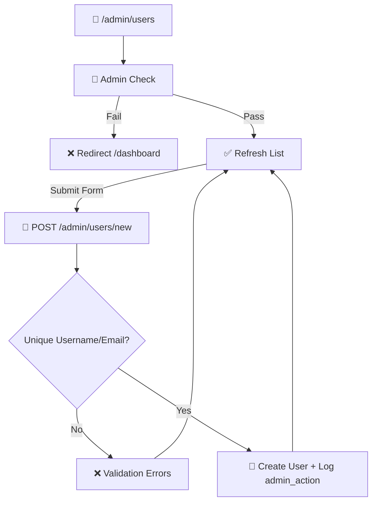
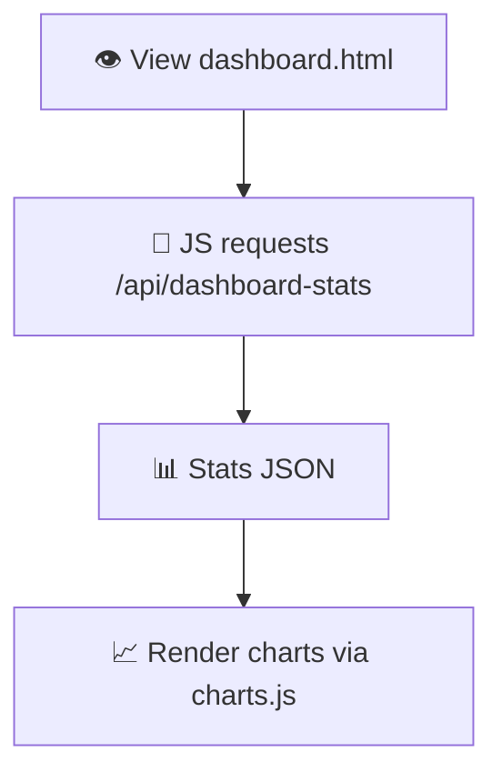
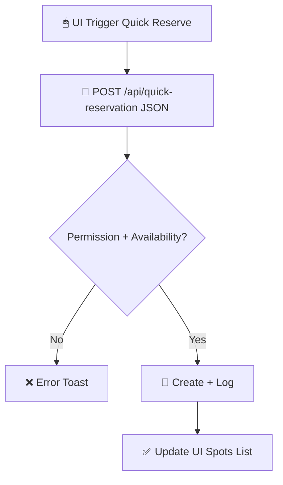
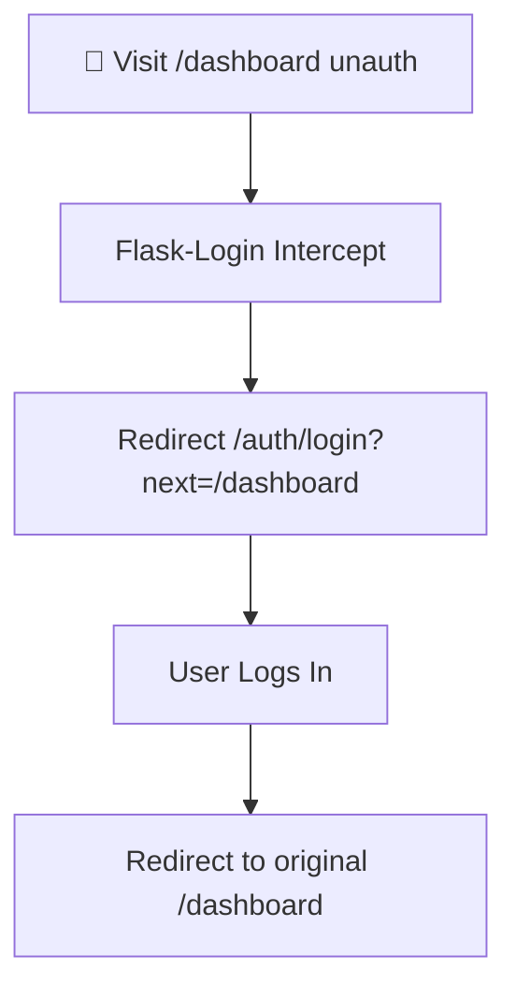

## User Flow Diagrams

### Mapping Table (Flows → Views/Templates)
| Flow | Blueprint Route(s) | Template(s) |
| ---- | ------------------ | ----------- |
| Registration | /auth/register | `auth/register.html` |
| Login | /auth/login | `auth/login.html` |
| Dashboard Overview | /dashboard | `dashboard.html` |
| Make Reservation | /reservations/new | `reservations/make.html` |
| Edit Reservation | /reservations/{id}/edit | `reservations/edit.html` |
| Cancel Reservation | /reservations/{id}/cancel (POST) | Redirect to `reservations/list.html` |
| List Reservations | /reservations | `reservations/list.html` |
| Create Carpool | /carpools/new | `carpools/create.html` |
| Carpool Detail | /carpools/{id} | `carpools/detail.html` |
| Admin Users | /admin/users | `admin/users.html` |
| Admin Parking | /admin/parking-spots | `admin/parking.html` |
| Admin Dashboard | /admin/ | `admin/dashboard.html` |

### Flow: User Registration


### Flow: User Login


### Flow: Make Reservation


### Flow: Edit Reservation
```mermaid
flowchart TD
    ER1[🚀 /reservations/{id}/edit] --> ER2[🔎 Load Reservation]
    ER2 --> ER3{Ownership/Admin?}
    ER3 -->|No| ER4[❌ Flash Permission Error]
    ER4 --> ER8[↩ Redirect /reservations]
    ER3 -->|Yes| ER5[📄 <a href='../templates/reservations/edit.html'><em>edit.html</em></a>]
    ER5 -->|Submit| ER6[🔗 POST Edit]
    ER6 --> ER7{New Spot/Date Valid?}
    ER7 -->|No| ER5
    ER7 -->|Yes| ER9[💾 Update + Log]
    ER9 --> ER8[✅ Redirect /reservations]
```

### Flow: Create Carpool


### Flow: Admin User Creation


### Flow: Dashboard Data (AJAX)


### Flow: Quick Reservation (API)


### Flow: Error Handling (Auth Protected Route)


### Notes & Visual Legend
- 🚀 START / entry
- ✅ Success path
- ❌ Error path
- 🔗 Endpoint interaction
- 📄 Template rendering
- 💾 Persistence + Audit log
- 🔎 Authorization / ownership validation

### Identified Gaps
- Carpool passenger identity not represented in flows (counter-only).
- Action logging fields mismatch for profile update (ip/user_agent).
