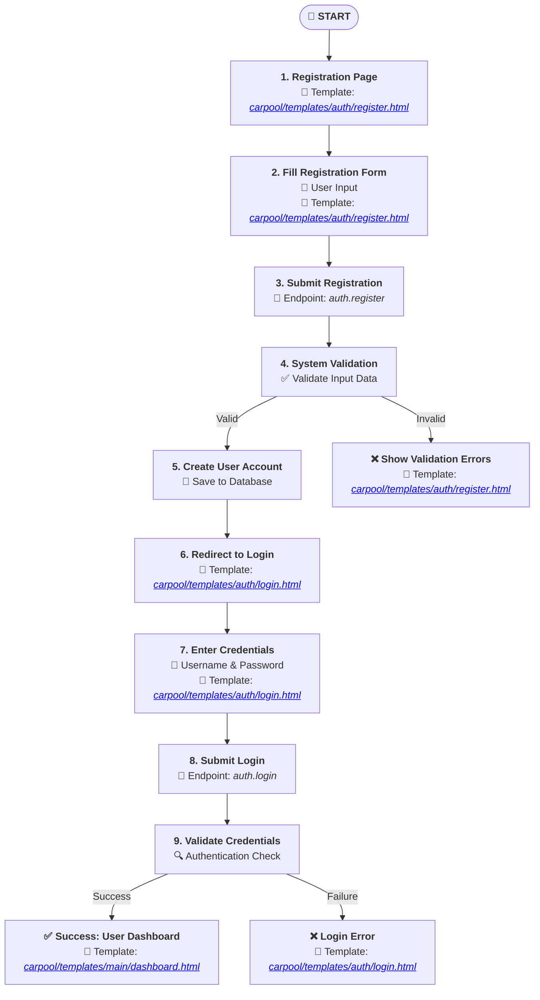
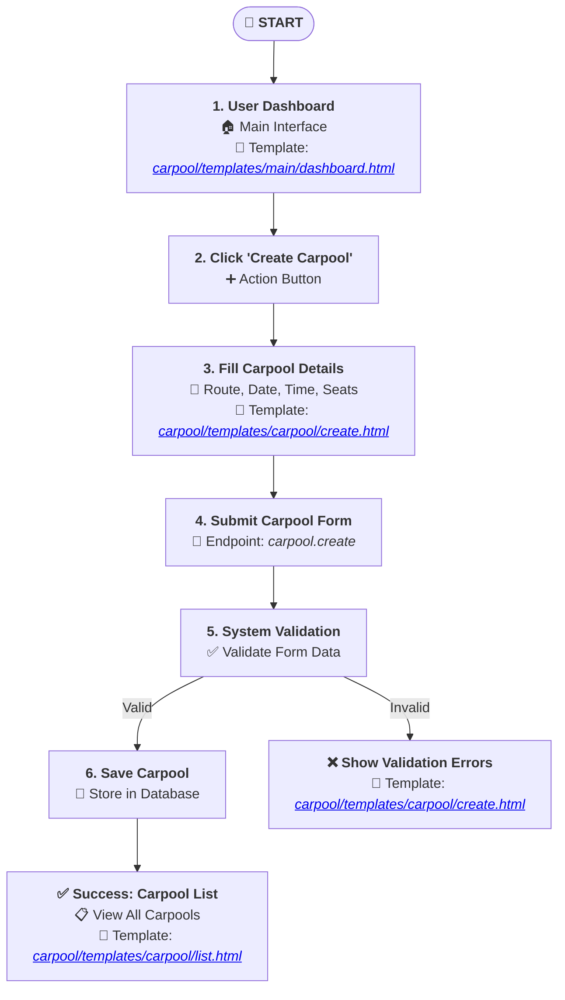
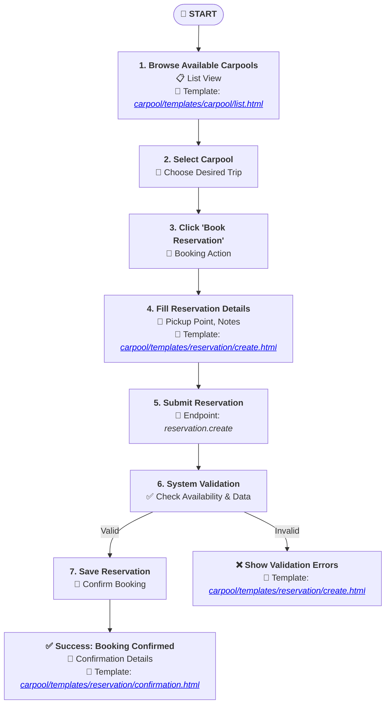
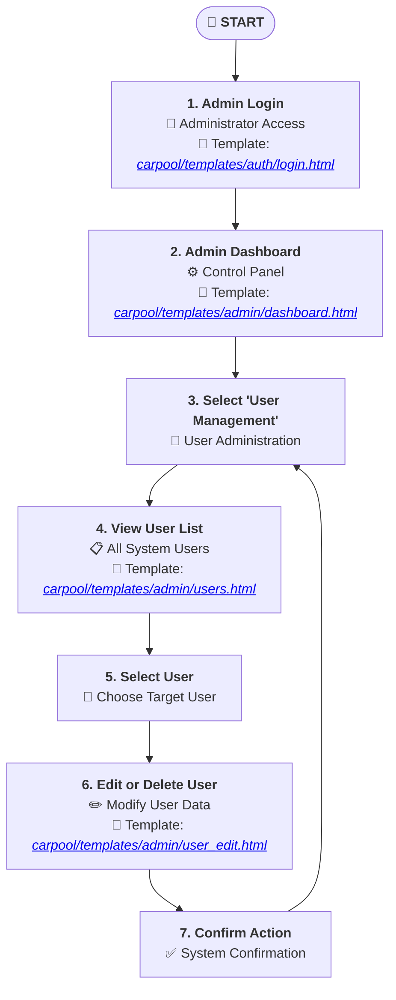

# User Flow Diagrams

This document provides user flow diagrams for the main user journeys in the carpool application. These diagrams illustrate the steps users take to accomplish common tasks, supporting both development and onboarding.

---

## Mapping User Flows to Flask Views and Templates

| User Flow                    | Blueprint / View Module         | Example Endpoint(s)                                                            | Template(s) Used                                               |
|------------------------------|---------------------------------|--------------------------------------------------------------------------------|----------------------------------------------------------------|
| User Registration and Login  | `auth` blueprint                | `[ /register ](/register)`, `[ /login ](/login)`                                | `[auth/register.html](auth/register.html)`, `[auth/login.html](auth/login.html)`          |
| Carpool Creation             | `main` or `carpool` blueprint   | `[ /carpools/create ](/carpools/create)`                                        | `[carpool/create.html](carpool/create.html)`                            |
| Reservation Booking          | `main` or `reservation` blueprint | `[ /carpools/<id>/reserve ](/carpools/<id>/reserve)`                            | `[reservation/create.html](reservation/create.html)`                        |
| Admin: User Management       | `admin` blueprint               | `[ /admin/users ](/admin/users)`, `[ /admin/users/<id> ](/admin/users/<id>)`      | `[admin/users.html](admin/users.html)`, `[admin/user_edit.html](admin/user_edit.html)`       |

---

## 1. User Registration and Login

---

## 2. Carpool Creation

---

## 3. Reservation Booking

---

## 4. Admin: User Management

---

*For additional user flows, extend this document as needed.*
